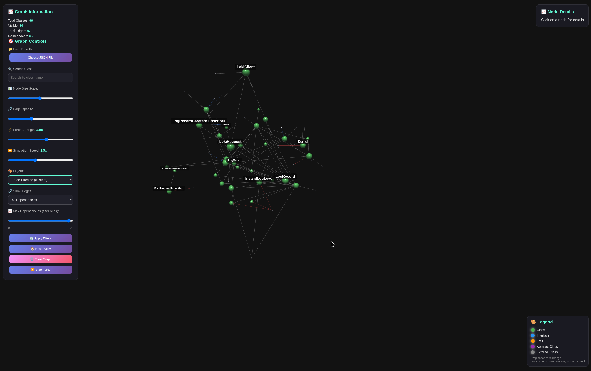
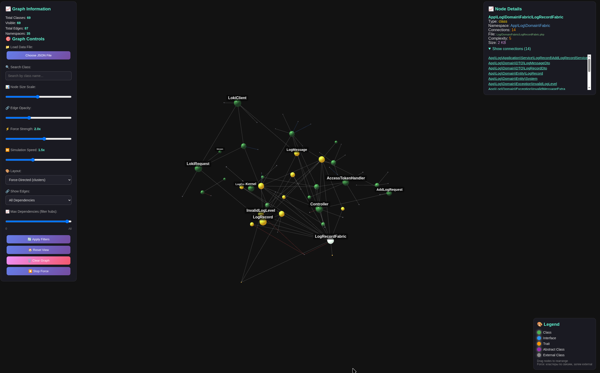

# PHP Class Visualizer

Инструмент для анализа PHP-проекта и визуализации зависимостей между классами в 3D-графе.

Приложение состоит из двух частей:

- PHP-парсер читает исходники проекта и строит `dependencies.json`.
- Веб-визуализатор открывает этот JSON и показывает классы, интерфейсы, трейты, external-зависимости и связи между ними.





## Требования

- Docker и Docker Compose.
- Для команд из `Makefile`: `make`.
- PHP-проект, который нужно проанализировать.

## Быстрый старт

1. Создайте `.env` из примера:

```bash
cp .env.dist .env
```

2. Укажите путь к PHP-проекту в `.env`:

```dotenv
PHP_MEMORY_LIMIT=2048M
PHP_MAX_EXECUTION_TIME=600
MOUNTED_FOLDER_PATH=/absolute/path/to/your/php/project
OUTPUT_FOLDER_PATH=./output
NGINX_PORT=8090
```

`MOUNTED_FOLDER_PATH` должен быть абсолютным путём к проекту, который нужно анализировать.

3. Соберите контейнеры:

```bash
make build
```

или без `make`:

```bash
docker-compose build
```

4. Запустите парсер:

```bash
make parse
```

После выполнения появится файл:

```text
output/dependencies.json
```

5. Запустите веб-визуализатор:

```bash
make run
```

6. Откройте в браузере:

```text
http://localhost:8090/visualizer.html?data=data/dependencies.json
```

Если порт изменён в `.env`, замените `8090` на значение `NGINX_PORT`.

## Рекомендуемый режим

**Force-Directed (clusters)**

## Типовой рабочий процесс

1. Меняете `MOUNTED_FOLDER_PATH` в `.env`.
2. Запускаете `make parse`.
3. Запускаете `make run`, если веб-сервер ещё не запущен.
4. Открываете визуализатор по URL выше.
5. При изменениях в анализируемом проекте повторяете `make parse` и обновляете страницу браузера.

## Команды

```bash
make help
```

Показать доступные команды.

```bash
make build
```

Собрать Docker-образы.

```bash
make parse
```

Запустить парсер для проекта из `MOUNTED_FOLDER_PATH`.

```bash
make run
```

Запустить веб-визуализатор на `NGINX_PORT`.

```bash
make logs
```

Показать логи контейнеров.

```bash
make stop
```

Остановить контейнеры.

```bash
make clean
```

Остановить контейнеры и очистить `output/*`.

## Ручной запуск парсера

Можно запускать парсер с дополнительными опциями:

```bash
docker-compose run --rm parser php /app/php_dependency_parser.php \
  -d /app/input \
  -o /app/output/dependencies \
  --format json
```

Полезные опции:

```bash
--format json
```

Создать `dependencies.json`.

```bash
--format gephi
```

Создать CSV-файлы для Gephi.

```bash
-s src
```

Сканировать только поддиректорию `src`.

```bash
-e '*Test*' -e '*test*'
```

Исключить файлы или классы по маске.

```bash
-i '*Controller.php'
```

Включить только файлы по маске.

```bash
--exclude-dirs var,node_modules
```

Добавить директории в список исключений.

```bash
--exclude-external
```

Не добавлять external-классы в граф.

```bash
--domain-namespace 'App'
```

Считать указанный namespace доменным. Это влияет на группировку external-зависимостей.

## Визуализатор

Основная страница:

```text
http://localhost:8090/visualizer.html?data=data/dependencies.json
```

Также можно загрузить JSON вручную через кнопку `Choose JSON File`.

### Основные элементы

- `Search Class` - поиск класса по имени.
- `Node Size Scale` - масштаб размеров узлов.
- `Edge Opacity` - прозрачность связей.
- `Force Strength` - сила физической раскладки.
- `Simulation Speed` - скорость симуляции.
- `Layout` - режим раскладки графа.
- `Show Edges` - фильтр по типу связи.
- `Max Dependencies` - фильтр для скрытия слишком связных узлов.
- `Apply Filters` - применить текущие фильтры.
- `Reset View` - сбросить фильтры, камеру и вернуть режим `Free`.
- `Stop Force` - остановить force-симуляцию и оставить текущие позиции.

### Режимы раскладки

- `Free` - свободный режим, узлы можно перетаскивать.
- `Force-Directed` - физическая раскладка с кластеризацией.
- `Sphere` - раскладка по сфере.
- `Grid` - сетка.
- `Radial` - радиальная раскладка вокруг наиболее связных классов.

### Работа с графом

- Клик по узлу открывает информацию справа.
- Клик по пустому месту снимает выделение.
- Перетаскивание узла меняет его позицию.
- Вращение сцены выполняется мышью через OrbitControls.
- Колёсико мыши приближает и отдаляет камеру.

## Где лежат результаты

По умолчанию:

```text
output/dependencies.json
```

В веб-контейнере этот же файл доступен как:

```text
data/dependencies.json
```

Поэтому URL для автозагрузки данных выглядит так:

```text
visualizer.html?data=data/dependencies.json
```

## Частые проблемы

### Визуализатор открылся, но граф пустой

Проверьте, что файл существует:

```bash
ls output/dependencies.json
```

Если файла нет, запустите:

```bash
make parse
```

### Ошибка с путём к проекту

Проверьте `MOUNTED_FOLDER_PATH` в `.env`. Это должен быть путь на машине, где запущен Docker.

Пример:

```dotenv
MOUNTED_FOLDER_PATH=/home/user/projects/my-app
```

### Парсеру не хватает памяти или времени

Увеличьте значения в `.env`:

```dotenv
PHP_MEMORY_LIMIT=4096M
PHP_MAX_EXECUTION_TIME=1200
```

После изменения `.env` перезапустите команду парсинга.

### После фильтров граф стал тяжёлым

Для больших проектов используйте:

- `Max Dependencies`, чтобы временно скрыть хабы.
- `Show Edges`, чтобы оставить только нужный тип связей.
- `Stop Force`, чтобы остановить симуляцию после подходящей раскладки.
- `Simulation Speed` и `Force Strength`, чтобы подобрать комфортную физику.

## Структура проекта

```text
php_dependency_parser.php  PHP-парсер зависимостей
visualizer.html            HTML-разметка 3D-визуализатора
visualizer.css             стили визуализатора
visualizer.js              логика визуализатора
docker-compose.yml         Docker Compose конфигурация
Dockerfile                 контейнер парсера
Dockerfile.web             контейнер nginx для визуализатора
entrypoint.sh              entrypoint парсера
output/                    результаты анализа
```
